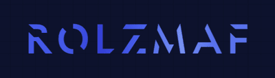

# Rolzmaf mini Framework



[](LICENSE)

Rolzmaf is a lightweight, modern PHP framework inspired by Laravel and built completely from the ground up as a **learning project**.  
The main goal is to understand how frameworks work internally — from routing, to ORM, to migrations — by implementing the core features ourselves.

**⚠️ Note**: This framework is not intended for production use. It is primarily for educational and experimental purposes.

## ✨ Features
“These features are implemented for learning purposes and may not cover all production edge cases.”

- **Routing**
    - Simple, expressive `Router` with middleware support.
    - Global & per-route middleware.
    - CSRF and Session middleware included.

- **Database & ORM**
    - QueryBuilder with:
        - `select`, `where`, `whereIn`, `orderBy`, `limit`, `first`, `find`, `exists`
        - `join`, `leftJoin`
        - `insert`, `update`, `delete`
        - `toSql()` for debugging queries
    - Secure column validation (whitelist + regex)
    - Relations:
        - `hasMany`
        - `belongsTo`
    - Eager loading with `with('relation')` to prevent N+1 queries.
    - SQLite & MySQL supported.

- **Migrations**
    - CLI commands for `migrate`, `rollback`, and `make:migration`.
    - Automatic foreign key constraints.
    - Schema builder with fluent API.

- **CLI Tools**
    - `make:controller`
    - `make:model`
    - `make:middleware`
    - Uses **stubs** with dynamic namespaces and nested folder support.

- **Testing**
    - Full PHPUnit test suite.
    - In-memory SQLite for ORM/QueryBuilder tests.
    - Unit tests for migrations, CLI commands, schema, and relations.

- **Security**
    - Strict PDO prepared statements everywhere (safe from SQL injection).
    - Whitelisted/validated columns and operators.
    - CSRF protection middleware.
    - Session management out-of-the-box.

## 🚀 Installation
“⚠️ This framework is meant for experimentation. Use at your own risk in production.”

```bash
git clone https://github.com/ZnarKhalil/rolzmaf-mini-framework.git
cd rolzmaf-mini-framework
composer install
cp .env.example .env

mkdir -p storage/logs
touch storage/logs/app.log
chmod 755 storage/logs
```
Update your .env with database credentials.

## 🛠️ Usage

- **Routing**

```php
// routes/web.php
return function (Router $router) {
    $router->addGlobalMiddleware(SessionMiddleware::class);
    $router->addGlobalMiddleware(CsrfMiddleware::class);

    $router->get('/', [ExampleController::class, 'index']);

    $router->get('/about', [ExampleController::class, 'about']);
};
```

- **Controllers**
```php
namespace App\Controllers;

use App\Models\Post;

class ExampleController
{
    public function index()
    {
        $posts = Post::query()
            ->with('user')
            ->limit(5)
            ->fetch();

        foreach ($posts as $post) {
            echo $post->title;
            echo $post->user->name;
        }
    }
}
```

- **ORM**

```php
// Find user
$user = User::query()->find(1);

// Insert
User::query()->insert([
    'name' => 'Znar',
    'email' => 'znar@example.com'
]);

// Update
User::query()->where('id', '=', 1)->update(['name' => 'Updated']);

// Delete
User::query()->where('id', '=', 1)->delete();

// Debug SQL
[$sql, $params] = User::query()->where('id', '=', 1)->toSql();

Relations

class Post extends Model {
    public function user() {
        return $this->belongsTo(User::class, 'user_id');
    }
}

class User extends Model {
    public function posts() {
        return $this->hasMany(Post::class, 'user_id');
    }
}
```

## 📦 CLI Generators

```bash
php rolzmaf make:controller Blog/PostController
php rolzmaf make:model Blog/Post
php rolzmaf make:middleware Admin/VerifyAdmin
```

Supports nested folders and auto-namespace generation.

## 🧪 Testing

```bash
vendor/bin/phpunit
```
Runs against SQLite in-memory database.


## 📌 Roadmap

Planned features we haven’t implemented yet:
- save() method on models (upsert style).
- Command Bus for jobs & queues.
- API Resources (transformers for JSON responses).
- Validation layer (FormRequests).
- Config caching & route caching.
- More drivers (PostgreSQL).
- Authentication scaffolding (sessions + tokens).
- Built-in HTTP client.

## 💡 Why Rolzmaf?

Rolzmaf exists to:
- Help developers learn the internals of frameworks like Laravel / Symfony by re-implementing the concepts.
- Focus on clarity and learning (showing how things work without hidden magic).
- Act as a portfolio project to showcase:
- PHP 8.2+ modern features
- Architecture & design patterns
- ORM & query builder design
- Middleware & routing

## 📄 License

This framework is open-sourced software licensed under the [MIT license](https://opensource.org/license/MIT).
